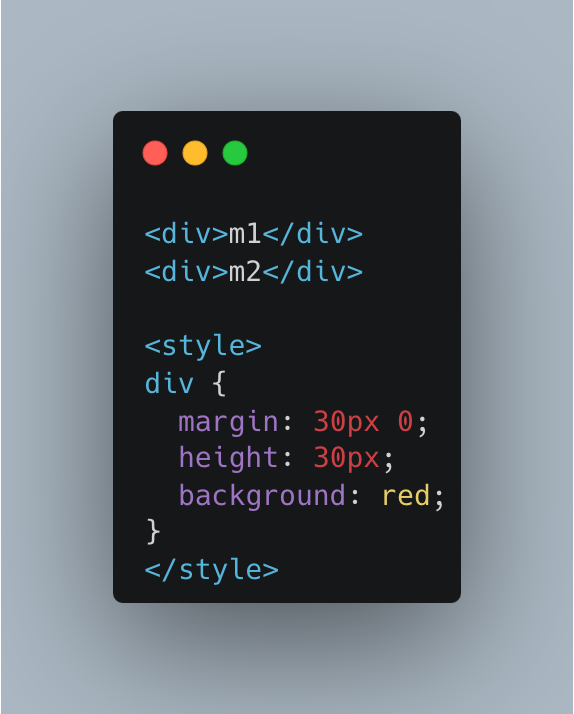
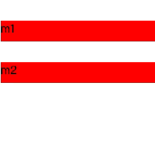
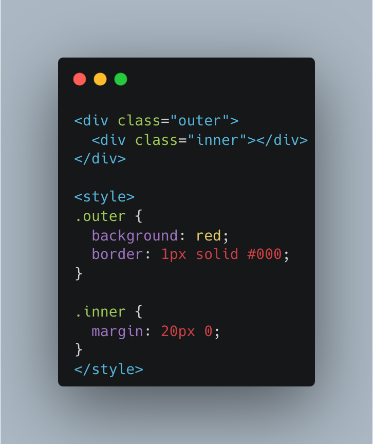

## Formatting Contexts

These terms mainly come from W3C，describing different formatting contexts and layout models in CSS.
### FC (Formatting Context):
The rules of the CSS rendering area，which determine how child elements are positioned and interact with other elements.

### BFC (Block Formatting Context):
An independent rendering area where the layout of elements does not affect external elements and is not affected by external elements.

- Elements are vertically stacked，and when calculating the height of a BFC，the height of floated elements is also considered. This is usually used to solve the issue of parent element height collapse.
- The BFC area does not overlap with float boxes.
- Creation methods: inline block elements，table cells，absolutely positioned elements，etc.

### IFC (Inline Formatting Context):
Inline elements are arranged from left to right and top to bottom，with line height determined by content. Inline elements on the same line will align to the same baseline.
The width of inline elements is determined by `padding`，`border`，and `margin`，but cannot exceed the width of the container. If it does，it will automatically wrap.

### GFC (Grid Formatting Context): Grid layout rules，generated by `display: grid` or `display: inline-grid`.
The position and width in the grid can be specified using properties like `grid-row` and `grid-column`.

### FFC (Flex Formatting Context): Flexible layout rules，created by display: flex or display: inline-flex.
Elements can be arranged along the main axis and cross axis.
The size and flexibility of elements in the container can be controlled using properties like `flex-grow`，`flex-shrink`，and `flex-basis`.

## Box Model

### What is the Box Model?
It describes the space occupied by each HTML element in the webpage layout and how to calculate the total width and height of an element.
Each HTML element can be considered as a box，consisting of content，padding，border，and margin.

### Content-box and Border-box
There are two calculation methods for the Box Model，which can be set using box-sizing: content-box and border-box.

content-box: The default calculation method. The total width of an element = content width (width) + left and right padding + left and right border width + left and right margin.
border-box: The total width and height of an element include the content，padding，and border，but not the margin.

## Collapsing Margins

- Collapsing margins refer to the phenomenon where when the top and bottom margins of two vertically adjacent block-level elements meet，they merge into a single margin，and the other margin has no effect，as if it were collapsed.
- Margin collapse only occurs vertically；horizontal margins do not collapse.

### Causes:
- Both parent and child elements are block-level，and the child element does not have the float property.
- The parent element does not have border，padding，or overflow properties to separate the inside and outside，resulting in the overlapping of margin-top and margin-bottom in a BFC situation.

### Common scenarios:

#### Case 1: Between adjacent sibling elements.
When you set two sibling elements `
m1
 
m2
` and give them both margin-top and margin-bottom，the margin-bottom of m1 will overlap with the margin-top of m2.

#### Case 2: Between the parent element and the first or last child element.

When you set a parent-child element and give the child element margin-top and margin-bottom，you'll notice that only margin-bottom takes effect.

### Solutions:

Any method that separates the two block-level elements will work，such as changing to `inline-block`，adding `border` or `float`，etc.
Two recommended methods: For Case 1，use `padding` instead of `margin`. For Case 2，use `overflow: hidden` or add the `border` property to the parent element.