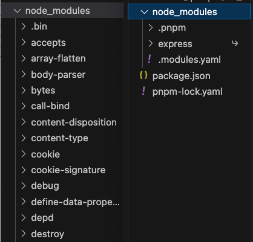
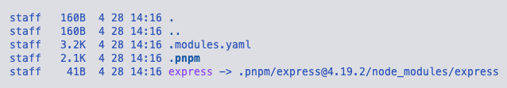
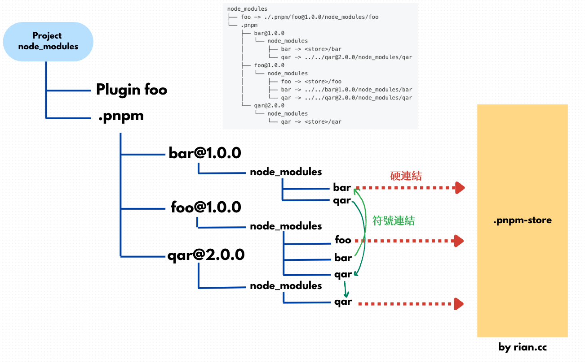

## Introduction
pnpm (performant npm) aims to improve speed and efficiency while reducing disk space. It uses a unique installation strategy: when you install packages with pnpm, it stores each package version in a global storage directory (`pnpm-store`, hereinafter referred to as Store). Then, `node_modules` creates a hard link to the corresponding version of the package in the Store. Each version of each package has a unique subdirectory, without duplicating `node_modules` for each project. This greatly saves local storage space and speeds up the download process. The installation location is usually at `~/Library/pnpm/store` (Mac system).

### Workspace
It supports the Monorepo architecture. The workspace can be defined using `pnpm-workspace.yaml`. If workspaces have dependencies, they use soft links, also known as symbolic links (symlinks), to each other.

### Hard Link
Hard links allow access to the same file from different locations. That is, the `node_modules` file directory in the project only contains links to the Store. A hard link associates multiple file names with the target file, so a hard link is a file, not a directory.
Taking the installation of express as an example, the left is the npm installation method, and the right is pnpm. In the past, npm would install the packages that express depends on in a flattened manner in `node_modules`; we can see from the figure below that pnpm solves this problem by referencing through symbolic links.



### Symbolic Link (Symlink)
A symbolic link is a special file that contains the path to other files or directories. pnpm uses symbolic links to manage the linking relationships between packages.



## Summary

### Hard Link

- Main purpose: Link packages from the local Store to each project.
- You can view different folders under the Store's files directory, all containing hard-linked files. Due to my limited knowledge, the content inside cannot be explored and verified.

### Symbolic Link, Soft Link

- Main purpose: Handle dependencies between packages.
- It belongs to the link file type and can be viewed using the `l` command.
- After installing packages in a project, soft links are automatically created in the `node_modules/.pnpm` directory. After removing packages, the soft links still exist in `node_modules/.pnpm` under the project.

Through the [official documentation](https://pnpm.io/zh-TW/symlinked-node-modules-structure), we can understand the relationship as follows:



### Commonly Used Commands:

- `pnpm install`
- `pnpm add [package]`
- `pnpm run [script]`
- `pnpm remove [package]`

## Extended Thinking

### Since yarn is already great, why do we need pnpm?

- Compared to yarn and npm, pnpm saves more disk space and has different download speeds.
- pnpm provides a stricter package resolution algorithm, ensuring that each package is installed - only once, avoiding duplicate installations and version conflicts.
pnpm natively supports the Monorepo architecture.

In a yarn or pnpm project, do I still need `package.json` and `package.lock.json`?
- We need `package.json` because it is the core file of a Node.js project, regardless of which package management tool you use.
- Previously, we mentioned that the lock file manages the package versions that the package depends on, so this is different. Yarn uses `yarn.lock` as its lock file, while pnpm uses `pnpm-lock.yaml`.
- If we use `yarn.lock` or `pnpm-lock.yaml`, we no longer need and should not have the `package-lock.json` file. If the files coexist, it may cause confusion or potential conflicts.
- If your project has used npm before and has `package-lock.json`, and you want to switch to yarn or pnpm in the future, you need to remove `package-lock.json`.

### If I use yarn or pnpm, can I still use commands like npx and nvm?
- `npx` first searches for executable files in the project's `node_modules/.bin` directory. If not found, it searches in the global package installation path, so it is not affected.
- `nvm` is a tool used to manage multiple Node.js versions. Both yarn and pnpm depend on the Node.js environment. However, it should be noted that when switching Node.js versions, yarn or pnpm may need to be reinstalled because they must correspond to a compatible Node.js environment.

### Is it possible to install packages with npm but not with yarn or pnpm?

- Usually, this will not happen because all three share the npm Registry.
- If the package uses npm-specific commands or syntax, yarn or pnpm may not be able to install it.
- If the package has complex dependencies, it may also be impossible to install. For example, if a project uses two packages that use the same sub-package but different versions, npm will install the newer version of package B, but yarn or pnpm may report an error.

  ```bash
  my-project/
    ├── package.json
    └── ...
  
  package-a/
    ├── package.json (依賴 package-c@^1.0.0)
    └── ...
  
  package-b/
    ├── package.json (依賴 package-c@^2.0.0)
    └── ...
  ```