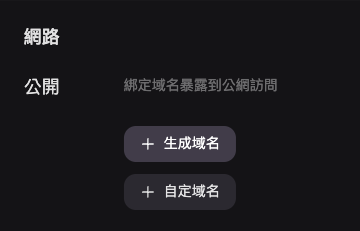

## Line LIFF

### What's Line LIFF？

Line LIFF is Line Front-end Framework, a front-end framework launched by Line platform. You can think of LIFF App as a completely independent website, except that we can interact with Line users through the JavaScript SDK launched by Line.


Opening through Line LIFF Browser.

### Why do we need to use LIFF?

With the SDK provided by Line LIFF, we can achieve the following:

- Obtain basic information of Line users. Including unique ID, display name, profile picture, and other basic information.
- Obtain device information of Line users. It can determine whether the user is using Line to open this device, thereby confirming their login status.
- When we can obtain the login status and Line user information, we can naturally allow users to skip the login step.

## Implementing a Line LIFF APP

### Importing Line LIFF into the project

You can import it via CDN or through NPM to import the [LIFF SDK](https://developers.line.biz/en/docs/liff/cli-tool-create-liff-app/#create-a-dev-env-using-liff-app)。

```html html
<script charset="utf-8" src="https://static.line-scdn.net/liff/edge/versions/2.22.3/sdk.js"></script>
```

```bash shell
$ npm install --save @line/liff
```

If you are building a LIFF APP from scratch, you can use the following command to start a new project. Personally, I prefer this method as it feels the fastest.

Create a LIFF App project.

```bash shell
$ npx @line/create-liff-app
```

Choose the framework technology you need:

```bash shell
? Which template do you want to use? (Use arrow keys)
❯ vanilla
  react
  vue
  svelte
  nextjs
  nuxtjs
```

Confirm the language you want to use:

```bash shell
? JavaScript or TypeScript? (Use arrow keys)
❯ JavaScript
  TypeScript
```

Enter the LIFF ID. You can skip this for now and change the environment variable later:

```bash shell
? Please enter your LIFF ID:
Don't you have LIFF ID? Check out https://developers.line.biz/ja/docs/liff/getting-started/ (liffId)
```

Choose your package management tool:

```bash
? Which package manager do you want to use? (Use arrow keys)
❯ yarn
npm
```

Done！

```bash
yarn install v1.22.19
warning package.json: No license field
info No lockfile found.
warning my-app@0.0.0: No license field
[1/4] 🔍  Resolving packages...
[2/4] 🚚  Fetching packages...
[3/4] 🔗  Linking dependencies...
[4/4] 🔨  Building fresh packages...
success Saved lockfile.
✨  Done in 25.06s.

Done! Now run:

  cd my-app
  yarn dev
```

### Deploy the project

As we mentioned earlier, a LIFF App is a completely independent website, so we need to deploy it on a public site first. Here, I recommend [Zeabur](http://zeabur.com/), a service team from a Taiwanese startup company with 24/7 customer service, and the documentation is in Traditional Chinese, which is truly moving.

I have used Heroku before and currently also use Netlify and Render. They are all very convenient, but Zeabur is literally "one-click deployment".

After logging in, click "Create Project" and "Deploy New Service".


Click on Git, and it will ask for authorization. Select the Repo where you store your LIFF App. After updates, push to Github, and Zeabur will directly update for you.


The interface is really nice. Click on "Network" at the bottom.


Expand and click on Generate Domain. Choose a name that you find easy to remember. If there are no conflicts, the deployment can be completed, which is really fast.



### Create Line Developer Provider

Next, go to the [Line Developer Console](https://developers.line.biz/console/) page, add a Provider, and add a channel. LIFF is currently only available for Login and Mini App, but Mini App is not yet enabled in Taiwan, so choose Login.


Here, you fill in the basic information. Pay attention to Channel Icon, Name, and Description, as users will see these when using LIFF.


After creation, select the LIFF menu to fill in the information.


Note:

- Size: There are options for full screen, half, and 1/3.
- If you want to obtain user information: Check profile and openid.
- **Endpoint URL: Fill in the URL where you deployed on Zeabur.**
- **Module mode: You can minimize the LIFF App.**


Then you get the LIFF URL and ID.


Then go back to the project, replace the VITE_LIFF_ID in `.env` with the ID, and add environment variables on Zeabur.

If you see the following screen, it means the connection is successful. You need to re-deploy on Zeabur after entering the environment variables for it to take effect.

