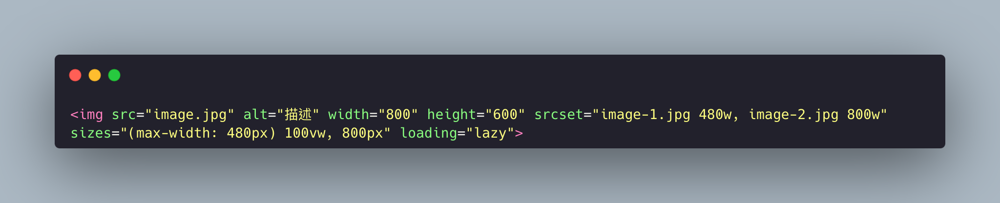
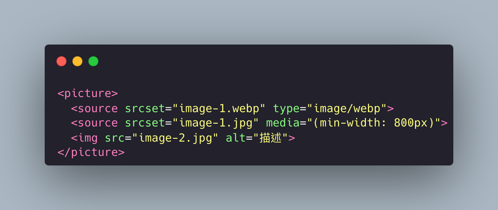
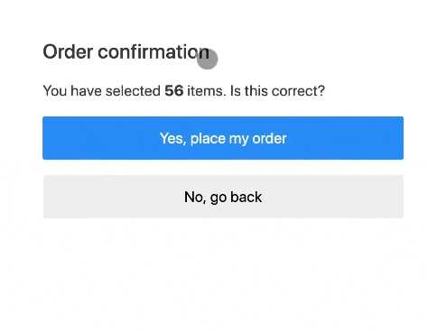

## MIME

File types can be represented by MIME:

- MIME is a way to represent the nature and format of a document, usually consisting of two parts: main type/subtype.
- Common examples include: text/html, text/javascript, audio/mpeg, video/mp4, application/json, image/jpeg, image/svg+xml, image/webp, etc.
- Application scenarios:
    - HTTP Response header: Specifies the MIME type of the content through Content-Type, telling the browser how to handle the received data.
    - Browser parsing: The browser parses and displays content based on the received MIME type. For example, if it's text/html, the browser will parse and render it.
    - File download: When the browser downloads a file, the server tells the browser how to handle the downloaded file through the set MIME type, such as whether to open it directly or save it after downloading.

## Basic Image Concepts

#### Vector Images and Raster Images
Digital images are divided into vector and raster.

Common vector formats include svg, eps, ai, pdf. They can be infinitely scaled without loss of quality, usually have smaller file sizes, are represented by geometric shapes, and are not suitable for complex images.

Common raster formats include jpg, png, gif, webp, avif. They use pixel grids to represent images, are suitable for complex images, may have jagged edges or distortion when enlarged, and usually have larger file sizes.
Commonly used image formats on the web:

    - .jpg: Relatively small file size, suitable for complex graphics, does not support transparency, high browser support.
    - .png: Relatively larger file size, suitable for complex graphics, supports transparency, high browser support.
    - .gif: Relatively small file size, limited color palette not suitable for complex graphics, high support, was the only format that could be presented as an animation in the early days, high browser support.
    - .webp: A modern image format developed by Google, intended to provide higher compression while maintaining good quality. Relatively smaller file size, supports transparency, supports animation, relatively low browser support (but should be quite widespread now), supports both lossy and lossless compression.
    - .avif: As of 2024, the latest emerging image format, based on AV1 video coding technology, an open standard developed by AOMedia. Also supports transparency and animation, can be 20% smaller than webp in compression ratio. Most notably, it supports HDR and wide color gamut to meet high-quality image needs, but browser adoption is still a significant challenge.
    - .svg: Compared to webp, it has an even smaller file size but is not suitable for complex graphics. Provides better animation effects on web pages compared to raster image animations. SVG elements can be controlled using CSS or JavaScript and also support responsive design without distortion.

### Suitable Image Formats

There is no best image format, only the most suitable one. We can evaluate the image format to use based on several factors: whether it supports transparency and animation, compression ratio, file size, image quality, and browser support.

| Format | transparency | animation | file size | compression ratio | image quality | browser support |
| --- | --- | --- | --- | --- | --- | --- |
| JPG | ❌ | ❌ | ⭐⭐⭐⭐ | ⭐⭐⭐⭐ | ⭐⭐⭐⭐ | ⭐⭐⭐⭐⭐ |
| PNG | ✅ | ❌ | ⭐⭐⭐ | ⭐⭐⭐ | ⭐⭐⭐⭐⭐ | ⭐⭐⭐⭐⭐ |
| GIF | ✅ | ✅ | ⭐⭐⭐⭐ | ⭐⭐ | ⭐⭐ | ⭐⭐⭐⭐⭐ |
| SVG | ✅ | ✅ | ⭐⭐⭐⭐ | ⭐⭐⭐⭐⭐ | ⭐⭐⭐⭐⭐ | ⭐⭐⭐⭐ |
| WebP | ✅ | ✅ | ⭐⭐⭐⭐ | ⭐⭐⭐⭐⭐ | ⭐⭐⭐⭐ | ⭐⭐⭐⭐ |
| AVIF | ✅ | ✅ | ⭐⭐⭐⭐⭐ | ⭐⭐⭐⭐⭐ | ⭐⭐⭐⭐⭐ | ⭐⭐⭐ |

## HTML Tags for Images

Images are usually loaded on web pages using HTML tags:

``: The most basic image tag format used to insert a single image.
Aside from the basic attributes (src, width, height), the more important ones are alt, srcset, loading, and sizes.
- alt: Represents alternative text that appears when the image cannot be displayed normally. This attribute affects the SEO performance of website images.
- srcset: Provides multiple sources and specifies the width or pixel density for each image source.
- sizes: Used in conjunction with the srcset attribute to specify the display size of the image under different device conditions. It tells the browser the size of the space the image should occupy under different device conditions.
- loading: Specifies the loading method of the image, which can be set to lazy loading or eager loading.

`<picture>`: This tag is a container tag that can provide multiple image sources for the same image. It can contain multiple source tags, with the last one being an img tag, which serves as the final fallback option when all source image sources fail to display.

The attributes in source include srcset, media, and type.
    - srcset: Same as the srcset in img, can contain multiple images separated by commas.
    - media: Used to specify the device size conditions.
    - type: Specifies the MIME type of the image, used to select the image format.

## Cumulative Layout Shift (CLS)

This is a case where a user accidentally clicks a button due to layout shifts.

CLS is a metric that measures the visual stability of a web page. When images are not given a width and height, the browser recalculates the page layout when loading the images, causing page elements to shift and affecting the user experience. To reduce CLS, it is recommended to set explicit width and height for images or use the CSS `aspect-ratio` property to specify the aspect ratio of the image, allowing the browser to reserve the correct space.

Many engineers may not know that CLS is actually detected in Google Search Console, which affects website SEO rankings.

### Solutions to CLS:

- Set the width and height of images or videos to avoid layout shifts.
- Use the CSS `aspect-ratio` property. For responsive images, you can specify the aspect ratio even if you don't know the actual dimensions, allowing the correct space to be reserved for the image.
- Use the CSS `contain` property to prevent element changes from affecting the positions of other elements.
- Use CSS `transform` property animations. `transform` does not cause CLS shifts.
- Preload fonts using `<link rel="preload">`. Preloading font resources can reduce layout shifts caused by fonts.
- Avoid dynamically inserting content, such as ads or banners. If dynamic loading is unavoidable, space needs to be reserved in advance.
- Delay loading of non-critical resources. Load important images, videos, etc. when the webpage first loads, while other secondary images and videos can be lazy-loaded to reduce layout shifts.
- Monitor the loading of third-party scripts to ensure that dynamic loading does not affect page layout.

## Extended Question

### Why can delaying the loading of non-critical resources reduce layout shifts?

Because if all resources are loaded initially, the page will have layout shifts due to adjusting the resources. If critical resources are loaded first and then secondary resources, the overall visual framework can be stabilized first.