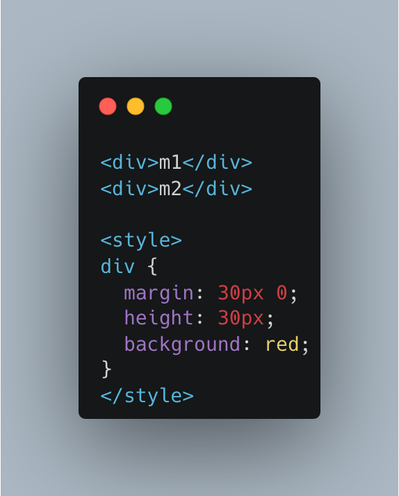
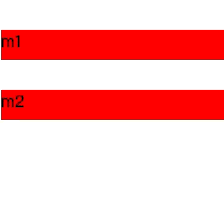
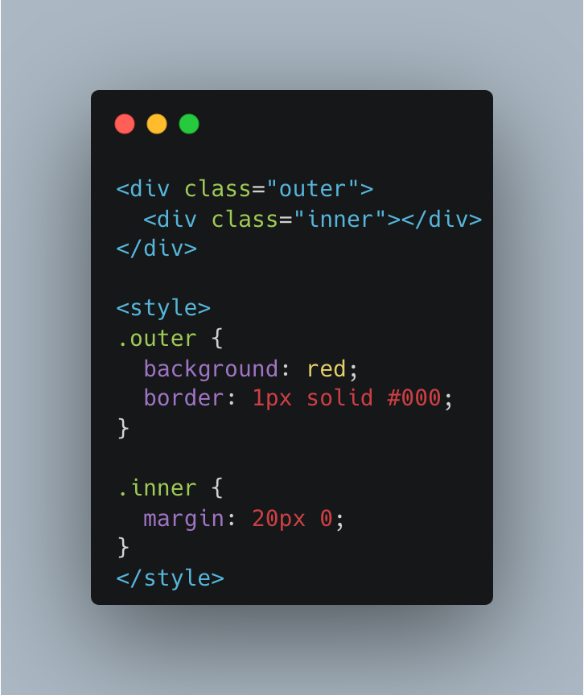
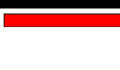

## BFC、IFC、GFC 和 FFC

- 這些名詞主要來自 W3C，主要描述 CSS 中，不同的格式化上下文和佈局模型。
### FC（Formatting Context）
CSS 渲染區域的規則，它決定子元素如何定位，以及和其他元素的交互作用與關係。
### BFC（Block Formatting Context）
是一個獨立渲染的區域，元素佈局不會影響到外部元素，同時也不會被外部元素影響。
  - 特性是垂直方向排列，然而在計算 BFC 高度時，也會計算浮動元素的高度，通常為了解決父元素高度塌陷的情況。（高度塌陷是指父元素中，只有浮動元素或是定位元素而導致父元素高度為零的情況。）
  - BFC 的區域不會與 float box 重疊。
  - 建立方式：行內元素區塊、表格單元格、絕對定位元素等等。
### IFC（Inline Formatting Context）
行內元素，為從左到右，從上到下排列，行高由內容決定，同一行內元素會對其同一基線上。行內元素寬度由`padding`、`border`、`margin` 決定，但不會超過容器的寬度，如果超過會自動換行。
### GFC（Grid Formatting Context）
網格佈局規則，它是由 `display: grid` 或 `display: inline-grid` 產生。可以透過 `grid-row`、`grid-column` 等等指定其在網格中的位置和寬度。
### FFC（Flex Formatting Context）：彈性佈局規則。它是由 `display: flex` 或 `display: inline-flex` 建立。
- 可以按照主軸（main axis）和交叉軸（cross axis）方向進行排列。
- 透過 `flex-grow`、`flex-shrink`、`flex-basis` 等屬性控制其在容器中的尺寸和伸縮行為。

## Box Model

### 什麼是 Box Model？
它是描述每一個 Html 元素在網頁佈局所佔據的空間，以及如何計算元素的總寬度及總高度。每個 Html 元素都可以看成一個盒子，分為內容（content）、內邊距（padding）、邊框（border）和外邊距（margin）。

### Content-box 以及 Border-box

Box Model 有兩個計算方式，可以透過 box-sizing 來設置：content-box 以及 border-box。
- content-box：元素的預設計算方式。元素的總寬度 = 內容寬度（width）+ 左右內邊距（padding）+ 左右邊框寬度（border）+ 左右外邊距（margin）。
- border-box：元素的總寬度和總高度包括內容、padding 和 border，而不包括 margin。

## Collapsing margins

Collapsing margins（外邊距折疊）是指說，當兩個垂直相鄰的塊狀元素的上下 margin 相遇時，他們會合併成一個 margin，另一個 margin 沒有作用，就像是被折疊起來。外邊距折疊只發生在垂直方向上，水平方向上的 margin 不會發生折疊情況。

### 造成原因：
  - 父元素與子元素都是 block，且子元素沒有 float 屬性。
  - 父元素沒有 border、padding、overflow 屬性將內外隔開，以至於在 BFC 的情況下，margin-top 和 margin-bottom 重疊。
### 常發生情境：
#### 案例一：相鄰的兄弟元素之間。
  - 當你設定兩個兄弟元素`
m1
 
m2
` ，並給他們都設置 margin top、bottom，則 m1 的 margin-bottom 會與 m2 的 margin-top 重疊。

#### 案例二：父元素和第一個或最後一個子元素之間。
  - 當你設定一個父子元素，將子元素設定 margin-top 與 margin-bottom，會發現僅有margin-bottom 有作用。

### 怎麼解決：
  - 將兩個塊狀元素隔開的方法都可以，像是改成 `inline-block`、`border`、`float` 等等。
  - 比較推薦的兩個方法，以案例一來說，可以使用 `padding` 代替 `margin`。以案例二來說，可以在父層使用 `overflow:hidden` 或是加上 `border` 屬性。