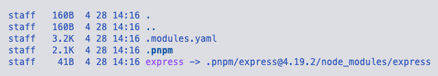
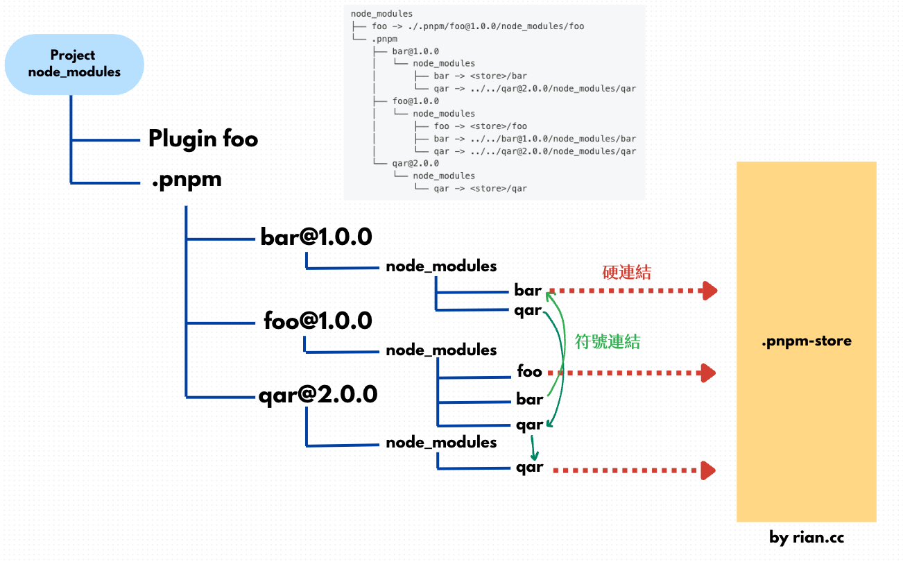

## 簡介
pnpm（performant npm），主要目標在於提升速度與效能，並且減少磁碟空間。使用獨特的安裝策略：當你使用 pnpm 安裝套件時，他會將每個套件的版本儲存全域的儲存目錄（ `pnpm-store`，以下簡稱 Store）中，接著 `node_modules` 會建立一個指向 Store 對應版本套件的硬連結。每個套件的各版本都有唯一的子目錄，不復刻各個專案的 `node _modules`，這大大的節省了本地的儲存空間並加速下載速度。安裝位置通常在 `~/Library/pnpm/store` (mac 系統)。

### 工作區（workspace）
支援 Monorepo 架構，使用 `pnpm-workspace.yaml` 可以定義工作區，工作區如果有相依性，彼此使用軟連結又稱符號連結（symlink）。

### 硬連結（hardlink）
硬連結允許不同位置可以訪問同一個檔案。也就是說專案下的 `node_modules` 檔案目錄只包含指向 Store 中的連結。硬連結是讓多個檔案名稱關聯到目標指向檔案，所以硬連結是檔案不是目錄。

以安裝 express 為例，左是 npm 安裝的方式，右是 pnpm。過往 npm 會將 express 所依賴的套件扁平化安裝在 `node_modules` 之中；pnpm 所要解決的問題從下圖我們可以看到 pnpm 透過符號連結的方式引用。


### 符號連結（symlink）
符號連結是一個特殊檔案，裡面包含了其他檔案或是目錄的路徑。pnpm 會使用符號連結來管理套件之間的連結關係。



## 總整理

### 硬連結

- 主要用途：將套件從本地端 Store 連結到各個專案。
- 進到 Store 的 files 目錄下可以查看到各個不同的資料夾，裡面全部都是硬連結檔案。由於日安底子不夠深，裡面內容無法探究及驗證。

### 符號連結、軟連結

- 主要用途：處理套件之間的相依性。
- 屬於連結檔案類型，使用 `l` 命令查看。
- 在專案中安裝套件後會自動在 `node_modules/.pnpm` 目錄中建立軟連結，移除套件後，查看專案下 `node_modules/.pnpm` ，軟連結仍然存在。


透過[官網文件](https://pnpm.io/zh-TW/symlinked-node-modules-structure)我們可以知道關係如下：



### 常用命令：

- `pnpm install`
- `pnpm add [package]`
- `pnpm run [script]`
- `pnpm remove [package]`

## 延伸思考

### yarn 既然已經很棒了 我們為什麼又需要 pnpm？

- yarn 及 npm 與 pnpm 相比，省更多磁碟空間，下載的速度也有所不同。
- pnpm 提供更嚴格的套件解析算法，確認每個套件都只被安裝過一次，避免重複安裝跟版本衝突。
- pnpm 天然支援 Monorepo 架構。 

### 在 yarn 或 pnpm 的專案下 我還需要 `package.json` 以及 `package.lock.json` 嗎？
- 我們需要 `package.json`，因為他是 Node.js 專案的核心檔案，不管你使用哪種套件管理工具都需要。
- 之前我們說到 lock 檔案是管理套件中所相依的套件版本，所以這有所不同。yarn 使用 `yarn.lock` 作為其鎖定檔案，而 pnpm 使用 `pnpm-lock.yaml`。
- 我們使用了`yarn.lock`或是`pnpm-lock.yaml`，之後都不需要，也不應該有`package-lock.json`檔案，如果檔案並存有可能會混淆或是引發潛在的衝突。
- 如果你的專案曾經使用過 npm 並且有`package-lock.json`，未來想要切換成 yarn 或是 pnpm，需要將`package-lock.json`移除。

### 如果我使用 yarn 或是 pnpm 我還可以使用 npx、nvm 等指令嗎？
- npx 會先在專案的 `node_modules/.bin` 目錄中尋找可以執行的檔案，如果找不到，則會在全域的套件安裝路徑中尋找，因此不受影響。
- nvm 是用於管理多個 Node.js 版本的工具，無論是 yarn 還是 pnpm 都會需要依賴 Node.js 環境，但須要注意的是在切換 Node.js 版本時，yarn 或是 pnpm 有可能會需要重新安裝，因為他們必須對應到符合的 Node.js 環境。

### 有可能在 npm 可以安裝套件，但是在 yarn 或是 pnpm 無法安裝的情況嗎？

- 通常是不會發生，因為他們三者都共用 npm Registry。
- 如果套件使用 npm 特有的命令或語法有可能 yarn 或 pnpm 沒辦法安裝。
- 如果套件的相依性複雜，也可能沒辦法安裝。比方說：專案使用兩個套件，他們使用相同子套件，卻不同版本，npm 會安裝比較新版本的套件 B，但 yarn 或 pnpm 有可能會報錯。

  ```bash
  my-project/
    ├── package.json
    └── ...
  
  package-a/
    ├── package.json (依賴 package-c@^1.0.0)
    └── ...
  
  package-b/
    ├── package.json (依賴 package-c@^2.0.0)
    └── ...
  ```