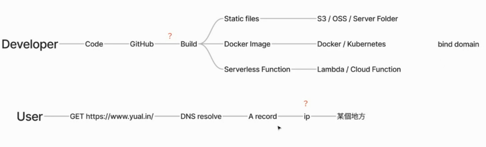

# 前言

早期大概三四年前，前端要簡易部署到雲服務，大部分是通過 PaaS 平台，那時候比較流行是用 heroku，當時需要在自己的專案上面裝 heroku-cli 工具，使用 command Line 才可以部署上服務，我依稀記得為了這件事我好像還串 CI/CD（那時候還沒有 Github Action），但現在已經不用這麼辛苦了。

現在大部分的 PaaS 平台，比方說 render、netlify 或是Zeabur，也就是本次的主講者人 Yuanlin 所開發的服務。

> Zeabur成立於2022年，此前已獲得來自奇績創壇的天使輪融資。公司定位於為獨立開發者和企業客戶提供大模型時代一鍵部署服務的PaaS平台，主要旨在幫助開發者解決兩方面的需求痛點：
> 
> 
> 一是，通過將服務器租用、配置環境、配置路由、配置域名、TLS證書申請等系列部署流程進行封裝，統一向開發者提供，以實現應用部署上線過程的自動化，簡化服務部署工作流；二是，通過採用「會員訂閱+按量付費」的模式，幫助開發者解決服務器租賃和硬件資源浪費的問題。
> 
> [介紹來自香港矽谷《早期項目｜以Vercel為標杆，服務部署PaaS平台「Zeabur」瞄準大模型時代開發者工具新機會》](https://www.hksilicon.com/articles/2294965)
> 

我們直接在這些 PaaS 的平台上面建立服務，並設定讓服務取得 Github Repo 授權，只要 Github 上面知道目前的 branch 有新的 commit，平台服務會自動幫我們 pull Repo 並且建置、部署。

## 大綱

主講人首先從一個最簡單的要點開始，就是程式碼部署系統的角色有哪些？寫出程式碼的人開發者，已經真正使用網站的使用者，從這個角度切入去開始梳理。

### 從開發者的角度

- 我們完成了一個專案程式。
- 接著上傳到 Giuthub，在上傳到雲服務器之前會需要建置（Build）。
- 從授權 Github 到建置（Build）的過程發生了什麼事（問題一）？

當建置完成，建置（Build）結果可能是一個：
- 靜態網站（Static Files）
- Container Image
- Serverless Functions。
- 最後成功上傳到某個地方（問題二），指向 Domain。

### 從使用者的角度
- 使用者送出一個造訪網站的請求。
- DNS 開始進行解析，DNS 將域名轉換成對應的 ip 地址。
可能是透過 CNAME Record (Domain)或是 A Record（IP）指向一個 ip。
- 那這個 ip 是什麼我們先不管（問題三），總之他一定會指向問題二的那個地方。

接著主講者在梳理流程的過程中，開始設下三個問題點，接著一步一步帶我們拆解這三個問題點。

### 那個地方是哪裡？

首先我們需要先知道某個地方（問題二）是什麼？其實就是雲服務。

靜態網站可能會上傳：

- OSS（Object Storage Service ）服務， 比方說 Amazon S3、GCP Storage 或是 Server folder。
- Container Image 可能會上傳到 Docker、Kubernetes。
- Serverless Functions 可能會在 Cloud Function，像是 Lambda 服務上。

（由於本講座屬於付費訂閱制的內容，更詳細的內容請參加 [E+ 成長計畫](https://www.explainthis.io/zh-hant/e-plu)，你會在直播討論區中「設計一個程式碼部署系統」討論串看到接下來的大綱與心得）。

## 心得

主講者先以「是誰在用我們這個服務」，把關鍵角色抓起來做起始點，再從這些角色怎麼開始使用這個服務，把流程拉出來，將當中可能會拓展的關鍵要素先遮蔽。

我可以理解先遮蔽的原因，如果直接開始展開的話，聽眾會有「我是誰我在哪」之感，展開結束後，我們會無法回到這些使用者故事的脈絡之中。

而當中這些關鍵因素就是我們要去探究的原因，除此之外，主講者還提到跨區域以及 DDoS 防範的概念，[更多內容請參考 E+ 成長計畫](https://www.explainthis.io/zh-hant/e-plus)（無工商推薦）。