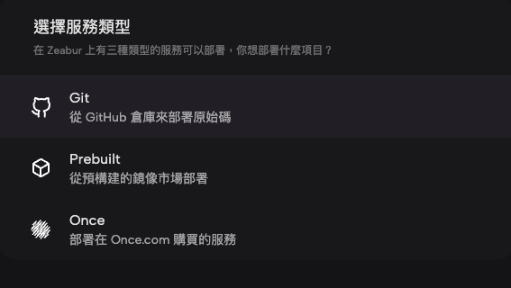
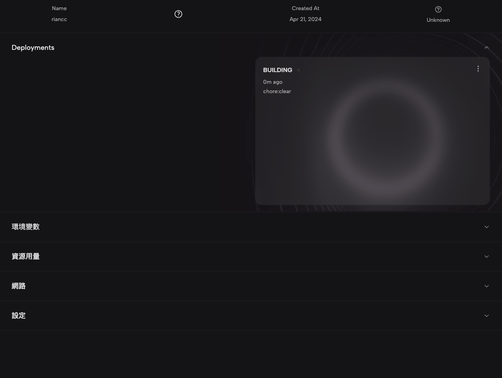
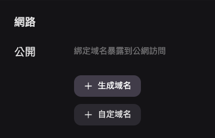
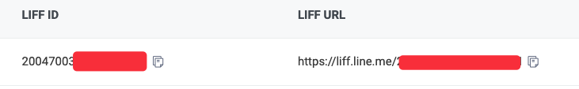

## 了解 Line LIFF

### 什麼是 Line LIFF？

Line LIFF 全名是 Line Front-end Framework，是由 Line 平台推出的一種前端框架。你可以想像 LIFF App 是一個完全獨立的網站，只是我們可以透過 Line 推出的 JavaScript SDK 與 Line 的用戶進行互動。


透過 Line LIFF Browser 開啟。

### 為什麼我們要使用 LIFF？

透過 Line LIFF 提供的 SDK，我們可以做到以下幾點：

- 取得 Line 用戶資訊基本資訊。包含 unique ID、顯示名稱、大頭照等基本資訊。
- 取得 Line 用戶裝置資訊。可以判斷使用者是不是使用 Line 開啟這個裝置，進而確認他的登入狀態。
- 當我們可以取得登入狀態、Line 使用者資訊，自然可以讓使用者省略登入步驟。

## 實作 Line LIFF APP

### 導入 Line LIFF 到專案中

你可以引入 CDN 、或是透過 NPM 引入 [LIFF SDK](https://developers.line.biz/en/docs/liff/cli-tool-create-liff-app/#create-a-dev-env-using-liff-app)。

```html html
<script charset="utf-8" src="https://static.line-scdn.net/liff/edge/versions/2.22.3/sdk.js"></script>
```

```bash shell
$ npm install --save @line/liff
```

如果你是從 0 開始建置 LIFF APP，可以透過以下指令開啟一個新的專案。
我個人會偏好這個方法，感覺最快。

建立 LIFF App 專案。

```bash shell
$ npx @line/create-liff-app
```

選擇你需要的框架技術：

```bash shell
? Which template do you want to use? (Use arrow keys)
❯ vanilla
  react
  vue
  svelte
  nextjs
  nuxtjs
```

確認你要使用的語言：

```bash shell
? JavaScript or TypeScript? (Use arrow keys)
❯ JavaScript
  TypeScript
```

輸入 LIFF ID，這邊可以先跳過，之後再更改環境變數：

```bash shell
? Please enter your LIFF ID:
Don't you have LIFF ID? Check out https://developers.line.biz/ja/docs/liff/getting-started/ (liffId)
```

選擇你的套件管理工具：

```bash
? Which package manager do you want to use? (Use arrow keys)
❯ yarn
npm
```

完成！

```bash
yarn install v1.22.19
warning package.json: No license field
info No lockfile found.
warning my-app@0.0.0: No license field
[1/4] 🔍  Resolving packages...
[2/4] 🚚  Fetching packages...
[3/4] 🔗  Linking dependencies...
[4/4] 🔨  Building fresh packages...
success Saved lockfile.
✨  Done in 25.06s.

Done! Now run:

  cd my-app
  yarn dev
```

### 部署專案

我們前面有提到，LIFF App 是一個完全獨立的網站，所以我們需要先部署在公開的站點上，我這邊推薦 [Zeabur](http://zeabur.com/)，這個服務團隊是來自台灣的新創公司，DC 24 小時客服，文件都是繁體中文，真的是痛哭流涕。
之前使用過 heroku，目前也使用過 netlify、render，他們都很方便，但 Zeabur 是實際意義上的「一鍵部署」。

登入之後點擊「創建專案」以及「部署新服務」。


點擊 Git，接著會跟你要授權，選擇你放 LIFF App 的 Repo，之後有更新，push上 Github，Zeabur會直接幫你更新。



介面真的很好看，點擊下方的「網路」。



展開後點擊生成域名，取一個你覺得好記得名字，沒衝突就可以完成部署了，真的很快。



### 新增 Line Developer Provider

接下來進到 [Line Developer Console](https://developers.line.biz/console/) 頁面，新增一個 Provider，新增一個 channel，LIFF 目前只開放給 Login 跟 Mini App，但 Mini App 台灣還沒啟用，所以選擇 Login。


這邊就是填基本資訊，要注意的是 Channel Icon、Name、Description，這些使用者在使用 LIFF 的時候都會看到。


建立好之後，選擇 LIFF 選單填寫資訊。


要注意：

- Size：有分滿版、一半、1/3。
- 如果要取得使用者資訊：profile 以及 openid 要打勾
- **Endpoint URL：將你在 Zeabur 部署的網址填上去。**
- **Module mode：你可以縮小 LIFF App。**


接者你得到 LIFF 網址以及 ID。



接者再回去專案，將 `.env` 的 VITE_LIFF_ID 替換 ID，以及在 Zeabur 上新增環境變數。

回去看到以下畫面就代表連接成功了，Zeabur 輸入好環境變數要再 Redeploy 才會成功。

